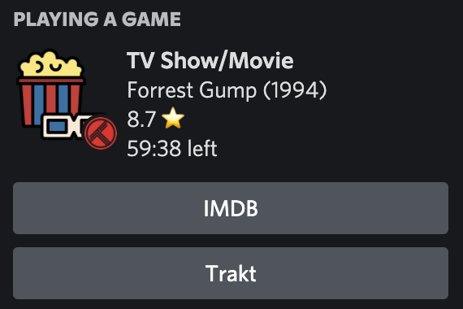

# Discrakt - Easy to Use Trakt/Plex Discord Rich Presence

  
  
  
  

A simple app that acts as a bridge between [Discord](https://discord.com/) and [Trakt](https://trakt.tv) (and maybe even [Plex](https://www.plex.tv/)), allowing for the display of the watch status as [Discord's Rich Presence](https://discord.com/rich-presence). Essentially, it's a Trakt/Plex Discord Rich Presence.

**Protip**: If you are already using Plex, and would like to link it with Trakt, you can use the [Plex-Trakt-Scrobbler](https://github.com/trakt/Plex-Trakt-Scrobbler) plugin.

If you already know **Trakt** and how awesome it is this is definitely the best option, as it works **more reliably** and with some extra benefits over the other implementations, such as registering your watch status **wherever you are watching** (TV, phone, across the world, etc.), **in whatever app you are watching on** (Netflix, Roku, Plex, HBO Max), as long as you have a single device running **Discord** and **Discrakt**.

Plex Rich Presence alternatives:
- [discord-rich-presence-plex](https://github.com/Phineas05/discord-rich-presence-plex)
- [plex-rich-presence](https://github.com/Ombrelin/plex-rich-presence)

## Setup

1. Edit the `credentials.ini` file with your Trakt username.
2. Run the respective executable, and you're ready to start sharing your progress!

*P.S.* Discord needs to be running on the machine Discrakt is running on. 

## Running executables

Running the executables is as easy as clicking the provided executables in the latest [release](https://github.com/EmanuelVH/discrakt/releases). That's it!

Optionally, after you ensure that everything is running correctly, you can also set the executable to run on startup, so that you don't have to run it manually every time you want to start sharing your watch status.

You can use the silent executable and follow [this guide](https://support.microsoft.com/en-us/windows/add-an-app-to-run-automatically-at-startup-in-windows-10-150da165-dcd9-7230-517b-cf3c295d89dd) to run it on startup.

## Development

Make sure you've installed Rust. You can install Rust and its package manager, `cargo` by following the instructions on [rustup.rs](https://rustup.rs/).
After installing the requirements below, simply run `cargo run`.

## Thank You

`movie` and `tv` icons by [iconixar](https://www.flaticon.com/authors/iconixar)
